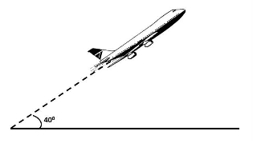
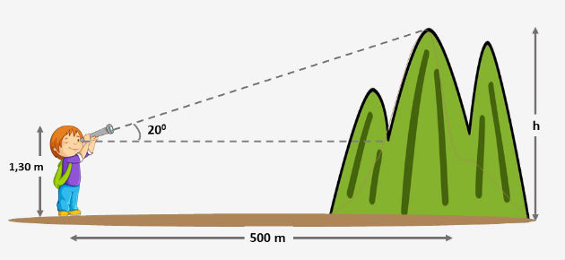

# Trigonometria

## Exercícios

1. Crie uma função para converter graus para radianos.
2. Preencha um vetor com o valor do seno para os seguintes valores em graus: 
   `{0º, 45º, 90º, 135º, 180º, 225º, 270º, 315º, 360º}` 
3. Preencha um vetor com o valor do cosseno para os seguintes valores em radianos:
   `{0, π/4, π/2, 3/4 * π, π, 5/4 * π, 7/4 * π, 2*π}`
4. Dado um avião que percorreu `h` metros em linha reta, sob um ângulo de `ang` graus, crie uma função para calcular 
   a que altura (em metros) este avião se encontra.
  
   

5. Um menino avista o ponto mais alto de um morro, conforme figura abaixo. Considerando que ele está a uma distância de 
   `x` metros da base do morro, calcule a altura `h` deste ponto.

   

## Nota

Todas as funções valem a mesma quantidade de pontos. A nota do trabalho é 
`número de questões corretamente resolvidas / total questões`. Por exemplo, resolveu 3 questões de 6, a nota é 5.

## Como entregar este trabalho

Você não precisa me entregar nada. Eu já tenho acesso ao seu repositório.

**CONTUDO**, não esqueça de enviar as suas modificações para o repositório remoto do Github:

```
git add .
git commit -m "implementei a primeira função"
git push origin main
```

**VERIFIQUE** o seu repositório remoto para ter certeza que as modificações estão lá!
